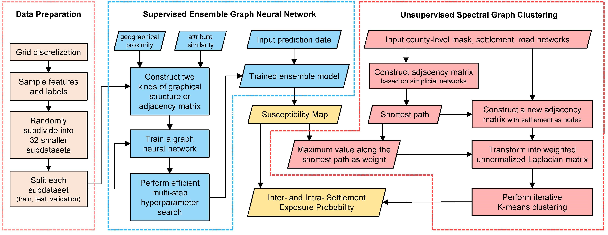
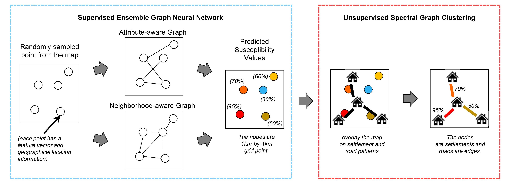
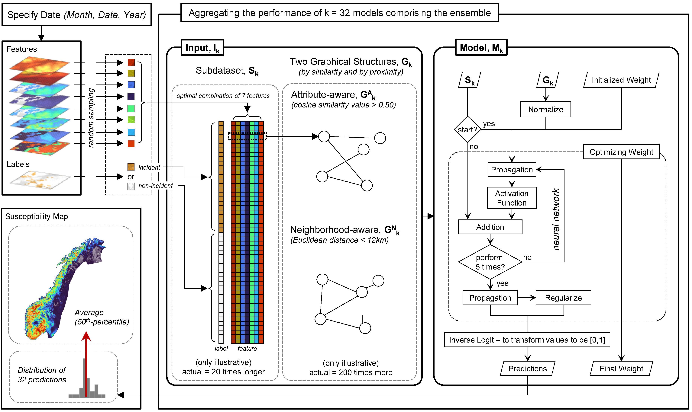
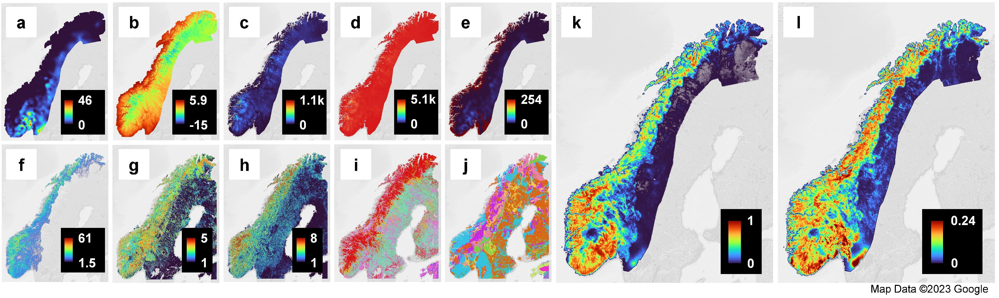
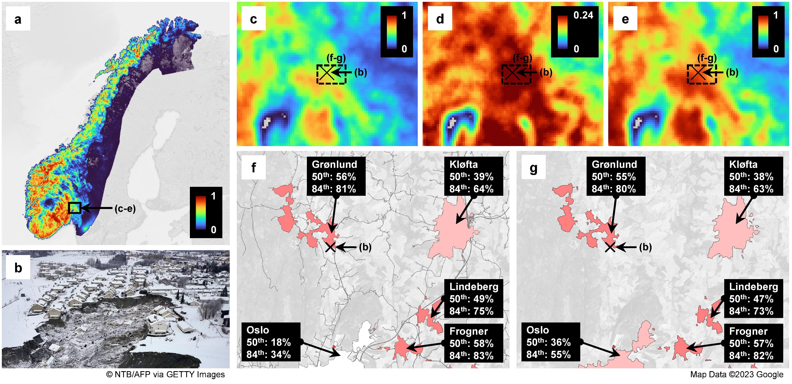
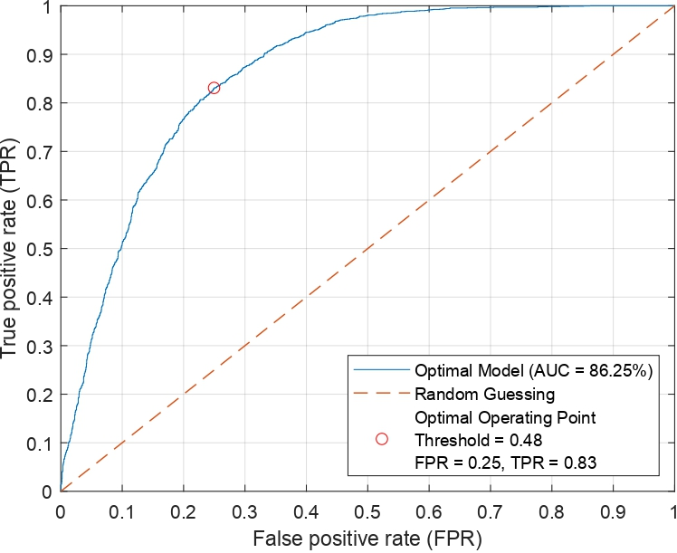

# **Near-real-time Country-wide Estimation of Susceptibility and Settlement Exposure from Norwegian Mass Movements via Inter-graph Representation Learning**

[](https://doi.org/10.5281/zenodo.8099812) [](https://opensource.org/licenses/MIT)


This GitHub repository contains the code, data, and figures for the Master of Research report [_Near-real-time Country-wide Estimation of Susceptibility and Settlement Exposure from Norwegian Mass Movements via Inter-graph Representation Learning_](/report/report_mres_dimasaka.pdf). If you have any questions, please contact [jtd33@cam.ac.uk](mailto:jtd33@cam.ac.uk).

---

## **1. Overview**

Our proposed inter-graph representation learning, which consists of two main steps: (1) Supervised Ensemble Graph Neural Network for susceptibility mapping and (2) Unsupervised Spectral Graph Clustering for settlement exposure assessment. The figures below show an schematic overview of the entire workflow. Please, refer to our report [link](/report/report_mres_dimasaka.pdf) for the detailed discussion of this implementation.

<p align="center">
    
</p>

<p align="center">
    
</p>


### **1.1. Supervised Ensemble Graph Neural Network**

<p align="center">
    
</p>

### **1.2. Unsupervised Spectral Graph Clustering**

<p align="center">
    
</p>

## **2. Installation**

This code depends on [MALTAB R2023a](https://uk.mathworks.com/), [QGIS 3.22.16-Białowieża](https://www.qgis.org/en/site/forusers/download.html), or any newer versions. The MATLAB toolboxes for [Mapping](https://uk.mathworks.com/products/mapping.html), [Financial](https://uk.mathworks.com/products/finance.html), [Statistics and Machine Learning](https://uk.mathworks.com/help/stats/getting-started-12.html), and [Deep Learning](https://uk.mathworks.com/help/deeplearning/ug/deep-learning-in-matlab.html) must also be installed to enable the data import and export of GeoTIFF files (*.tif) and perform the deep learning training.

## **3. Data**

All datasets used in this study are publicly available through the [Norwegian Licence for Open Government Data (NLOD)](https://data.norge.no/nlod/en) and any specified below. We made a complete copy of the files used for our study in our Zenodo repository. All datasets except those from MET Norway were pre-processed to be suitable as a machine learning input. These pre-processing technqiues were rasterization from being a vector polygon or line data such as the road networks and settlements.

* Mass Movement Incidents (Norwegian Water Resources and Energy Directorate): [Catalog Link](https://kartkatalog.nve.no/#metadata) 
* Features
    * Total rainfall and mean temperature (MET Norway): [THREDDS Data Server Link](https://thredds.met.no/thredds/catalog/senorge/seNorge_2018/catalog.html)
    * Snow depth, snow water equivalent, and fresh snow water equivalent (MET Norway): [THREDDS Data Server Link](https://thredds.met.no/thredds/catalog/senorge/seNorge_snow/catalog.html)
    * Steepness (Norwegian Water Resources and Energy Directorate): [Catalog Link](https://kartkatalog.nve.no/#metadata)
    * European Landslide Susceptibility Map version 2 (ELSUS v2) (ESDAC): [Catalog Link](https://esdac.jrc.ec.europa.eu/content/european-landslide-susceptibility-map-elsus-v2#tabs-0-description=0)
* Urban Formal Settlements (Statistics Norway): [Geonorge Link](https://kartkatalog.geonorge.no/metadata/28906bc8-a644-43d5-bbdb-33a217f458ef)
* Transport Network Road (Norwegian Mapping Authority): [Geonorge Link](https://kartkatalog.geonorge.no/metadata/inspire-transport-network-road/a76704df-fdd4-4e09-92ac-a7ad1a77b328)
* County-level Masking from Global Administrative Areas (GADM), Version 4.1: [CC BY 4.0)](https://gadm.org/license.html)


## **4. Code**

Due to the limited file storage capacity in GitHub, we provide all training datasets and results (>45GB) in our Zenodo repository. The `intergraph.mlx` is an interactive notebook, which calls and implement all other functions. 

* `intergraph.mlx`: This user notebook allows staged implementation of the code. It consists of five major steps.
  * `prepareData.m`:  This function samples features and labels. It also splits the dataset using 70/15/15 ratio for training, validating, and testing subdatasets. It also performs the ensemble subdivision by assigning equally represented incident and non-incident for each of the 32 subdatasets. Generally, this function loads post-processed GIS files in a form of tables, specify a random seed for sampling, and outputs features for each valid (i.e., not NaN) location on the gridded map. It also outputs the number of ensembles and coordinates of each valid location for mapping purposes later. This only takes 0.26 seconds for using prepared data, and about 4.2 minutes if the user would like to load the source files. The output can be found under the folder `data\feature`.
  * `createGraph`: This function creates the neighborhood-aware and attribute-aware adjacency matrix for all subdatasets generated in the previous step. It loads the outputs of `prepareData.m` and outputs individual `.mat` files of adjacency matrices under the `data/graph` folder. This only takes 5 seconds for both prepared and self-run operations.
  * `applyGNN`: This function perform the **Supervised Graph Neural Network** for the datasets and graphical structures, respectively from `preparedData.m` and `createGraph.m`. This also implements a hyper-parameter search for the best feature selection for each of the 32 machine-learning modes. It outputs `trainAUC_map`, `validAUC_map`, `testAUC_map`, `epoch_map`, `muX_map`, `sigsqX_map`, and `parameter_map`, which all contain the individual results for each of the 11 feature selections, 32 subdataset, and 20 random weight initialization seeds. However, we woudl advise running this if you have the computational budget (i.e., each output file has ~780MB for each random seed) and time because running this would take 4.9+ hours, but the prepared data (when you specify `opt3 = 0` in `intergraph.mlx`) would take only about 18 minutes. Each file has ~780MB for each random seed. The outputs can be found under the folder `results\applyGNN`.
    * `initializeDL.m` - This function initializes the weight for neural network training using the `initializeGlorot.m`.
    * `model.m` - This function perform the deep learning model including the regularization.
    * `modelLoss.m` - This function calculates the gradient and loss for every epoch.
    * `preprocessAdjacency.m` - This performs the splitting of adjacency matrices into training, validating, and testing, and normalizes the adjacency matrix using the calculated degree of the matrix using the `normalizeAdjacency.m`.
    * `preprocessFeature.m` - This performs the feature selection indexing and calculates the mean and standard deviation for the normalization of the feature inputs.
    * `preprocessLabel.m` - This performs the label assignments based on the specified splitting for subdataset.
    * `runGCN.m` -This is the main subfunction that performs the graph neural network for a given random seed, feature selection, and subdataset.
    * `splitData.m` - This performs the splitting of subdataset into training, validating, and testing.
    runGCN
  * `selectGNN.m`: This function processes and selects the most optimal machine-learning configuration for each of the 32 models comprising the ensemble, based on the highest area under the ROC curve (refer to our report for the details). It also individually loads the output from `applyGNN.m`,  test each trained machine-learning model to every test subdataset, and exports the ROC curve figure presented on the report. The outputs can be found under the folder `results\selectGNN`.
  * `mapSusceptibility.m`: This function inputs a user-specified data (D,M,YYYY) and loads the features from large NetCDF files. We provided only the year 2022 files because each single file exceeds 2GB file, which cannot be handled by GitHub or Zenodo efficiently. We, however, advise to download those data from the links provided in *([**3. Data**](#3-data)*). Generally, this function extracts all features and creates the graphical structure needed for the specified data. It then runs the trained machine learning model using the slected GNN for each of the 32 machine-learning models, and aggregate the predictions using mean (50th-percentile) or compute for 84th-percentile with standard deviation. The outputs can be found under the folder `results\mapSusceptibility`.
  * `evaluateSettlement.m`: This function perform the **Unsupervised Spectral Graph Clustering** using the outputs from `mapSusceptibility.m`. It also loads the simplicial network adjacency matrix, describing the topology of road networks and settlements for each county-level mask. We slightly discourage to perform the `createADJsimplex.m` and `extractSettlementNodeIdx.m` because these two sub-functions would take very long hours (>7hrs). However, the outputs from these two subfunctions are consistent and does not change every time we perform `evaluateSettlement.m`, hence, no need to re-run it every single time we try to assess the settlement exposure.
    * `createADJsimplex.m` - This function creates an adjacency matrix for the roads and settlements using a spatial resolution of 50 meters, which could be very computationally challenging for large county-level masks such as Oslo and Viken, which have many settlements. We listed below estimated runtime for each county.
        *  County 1 - Agder - 369k-by-369k-sparse-matrix - 11min
        *  County 3 - Troms og Finnmark - 388k-by-388k-sparse-matrix - 14min
        *  County 4 - Møre og Romsdal - 286k-by-286k-sparse-matrix - 6.5min
        *  County 5 - Vestfold og Telemark - 455k-by-455k-sparse-matrix - 17.5min
        *  County 6 - Trøndelag - 640k-by-640k-sparse-matrix - 33.5min
        *  County 7 - Rogaland - 275k-by-275k-sparse-matrix - 6.8min
        *  County 8 - Innlandet - 1151k-by-1151k-sparse-matrix - 1hr 48min
        *  County 10 - Nordland - 383k-by-383k-sparse-matrix - 11.4min
        *  County 11 - Vestland - 562k-by-562k-sparse-matrix - 26.8min
        *  County 29 - Oslo and Viken - 1010k-by-1010k-sparse-matrix - 1hr 17min
    * `extractSettlementNodeIdx.m` - This function randomly sample a representative node index for each settlement using the outputs of `createADJsimplex.m`.

## **5. Results**

We demonstrate our inter-graph representation learning using the 2020 Gjerdrum quick clay incident as a case study.

Figure Description: Date-specific maps of (a) total rainfall (mm/day), (b) mean temperature (Celsius degrees), (c) snow depth (cm/day), (d) snow water equivalent (mm/day), and (e) fresh snow water equivalent (mm/day) for December 30, 2020. Static maps of (f) steepness (degrees), (g) ELSUS susceptibility (categorical integer), (h) slope angle class (categorical integer), (i) land cover class (categorical integer), and (j) lithology class (categorical integer). Resulting (k) average (50th-percentile) susceptibility map with (l) calculated standard deviation using the estimates of 32 machine-learning models

<p align="center">
    
</p>

Figure Description: (a) Country-wide map of average (50th-percentile) susceptibility December 30, 2020; (b) a photo showing the extent of the quick clay incident; a set of magnified maps: (c) average, (d) standard deviation, and (e) upper limit or 84th-percentile; Five neighboring settlements around the incident, each showing (f ) the minimum triggering exposure probability of mass-movement-susceptible roads for inter-settlement isolation and (g) the intra-settlement exposure probability of being a mass-movement-susceptible area.

<p align="center">
    
</p>


## **6. Performance**

Using the ROC curve, we show that our model achived an aggregate AUC of 86.25%.
<p align="center">
    
</p>

## **7. Repository Structure**

If some of the folders are not available, please refer to our Zenodo repository because GitHub limits our file uploads and does not allow large files.


```
├───code
│   └───helper
├───data
│   ├───custom
│   │   └───graph
│   ├───elsus
│   ├───feature
│   ├───graph
│   ├───incidents
│   ├───mask
│   │   ├───adjacency_files
│   │   ├───raster_maps
│   │   └───settlement_node_idx
│   ├───road
│   └───settlement
│       └───settlement2022
├───figures
└───results
    ├───applyGNN
    ├───custom
    │   ├───seNorge
    │   └───seNorgeSnow
    │       ├───fsw
    │       ├───sd
    │       └───swe
    ├───evaluateSettlement
    │   ├───table
    │   └───vector
    ├───mapSusceptibility
    └───selectGNN
```

## **7. Acknowledgements**
This work is supported by the UKRI Centre for Doctoral Training in "Application of Artificial Intelligence to the study of Environmental Risks" in the Department of Earth Sciences at the University of Cambridge. We thank the supervision support from  [Andrea Marinoni](https://www.andreamarinoni.com/) and [Sakthy Selvakumaran](http://www.eng.cam.ac.uk/profiles/ss683), and guidance from Annabelle Scott and Adriana.

## **8. Want to cite this GitHub repository?**
Feel free to use our recommended BibTex-formatted entry below.
```
@software{dimasaka_joshua_2023_8099812,
  author       = {Dimasaka, Joshua},
  title        = {{Near-real-time Country-wide Estimation of 
                   Susceptibility and Settlement Exposure from
                   Norwegian Mass Movements via Inter-graph
                   Representation Learning}},
  month        = jun,
  year         = 2023,
  publisher    = {Zenodo},
  doi          = {10.5281/zenodo.8099812},
  url          = {https://doi.org/10.5281/zenodo.8099812}
}
```
