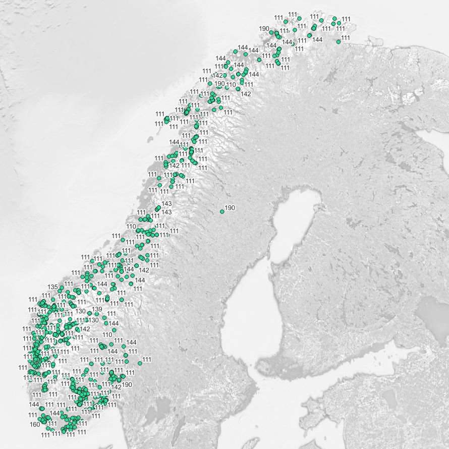

# **Landslide Incidents**

## **Preview**

    

## **Metadata**
- Author: Norwegian Water and Energy Directorate
- Date: February 2015
- Descripton: Point indication for an area where a landslide has occurred and key information about the landslide
- Source: [https://nedlasting.nve.no/gis/](https://nedlasting.nve.no/gis/)
- Count: 886

## **File Description**
- landslide_incidents.xlsx (a spreadsheet file)
- landslide_incidents.gpkg (a GIS vector point file)

## **Field Names**
- `fid`: identification
- `avalanche_ID`: identification
- `landslideType`: type of landslide event
- `landslideName`: name of landslide event
- `placeName`: location of landslide event
- `YYYY`: year of landslide event (in UTC)
- `MM`: month of landslide event (in UTC)
- `DD`: date of landslide event (in UTC)
- `HH`: hour of landslide event (in UTC)
- `MM`: minutes of landslide event (in UTC)
- `SS`: seconds of landslide event (in UTC)
- `noyTidspt`: accuracy of time
- `noyPosition`: accuracy of location
 - `persOrt`: Whether **persons** were affected
 - `buildingDamaged`: Whether **buildings** were damaged in the landslide
 - `roadDamaged`: Whether the **road/road-related installations** were damaged in the landslide
 - `pathInjured`: Whether **railway/railway-related installations** were damaged in the landslide 
 - `sJDSkated`: Whether **forestry/agriculture/farming** was damaged in the landslide.
 - `frmkDamaged`: Whether **means of access** were damaged in the landslide.
 - `anneSkadet`: Whether **other economic/socially beneficial installations** were damaged in the landslide.
 - `evacuation`: Whether an **evacuation** was initiated in the landslide area.
 - `rescueCase`: Whether **rescue operation(s)** were initiated in the landslide area.
 - `techParam`: Whether landslide technical parameters have been recorded about the landslide.
 - `riverWave`: Whether the landslide triggered **tidal wave** activity
 - `eyewitness`: Whether there were any **eyewitnesses** to the landslide.
 - `document`: Whether there is any form of documentation (photos, reports, newspaper articles, etc.)
 - `source`: Name of agency etc. who registered the landslide event, possibly source if the landslide event has been imported from other databases
 - `described`: Comment description of the avalanche event (may contain info like estimated avalance volume and road cutting length)
 - `objType`: Object type according to code list (e.g., "LandslideObsHistorical")
 - `regStatus`: Status for registeringen.
 - `regDate`: Date of when the registration was carried out.
 - `changedDate`: Date of change of registration.
 - `withdrawalDate`: Date of withdrawal of the data from NVE's databases
 - `x`: longitude coordinates using WGS84 (EPSG:4326)
 - `y`: latitude coordinates using WGS84 (EPSG:4326)

## **Distribution**
### **Table 1. Landslide Type**
| Code 	| Description 	| RGB Color Style 	| Count 	|
|:---:	|:---:	|:---:	|:---:	|
| 110 	| Rockslide 	| 204-204-204 	| 6 	|
| 111 	| Rockslide 	| 204-204-204 	| 750 	|
| 130 	| Avalanche 	| 230-255-255 	| 21 	|
| 133 	| Avalanche 	| 230-255-255 	| 1 	|
| 135 	| Avalanche 	| 230-255-255 	| 2 	|
| 138 	| Avalanche 	| 230-255-255 	| 2 	|
| 139 	| Avalanche 	| 230-255-255 	| 3 	|
| 141 	| Mudslides 	| 255-170-0 	| 2 	|
| 142 	| Flood landslide 	| 255-255-0 	| 17 	|
| 143 	| Mudslides 	| 255-170-0 	| 3 	|
| 144 	| Landslide 	| 168-112-0 	| 60 	|
| 160 	| Slippage 	| 0-0-0 	| 10 	|
| 190 	| Not specified 	| 115-255-223 	| 9 	|
| Total 	|  	|  	| 886 	|

### **Table 2. Temporal Distribution**
|  Year | Month | Count |
|:-----:|:-----:|:-----:|
|  1980 |   8   |   1   |
|  1981 |   5   |   1   |
|  2015 |   3   |   1   |
|  2016 |   3   |   1   |
|   |   4   |   2   |
|  2018 |   10  |   1   |
|  2019 |   2   |   2   |
|   |   3   |   1   |
|   |   8   |   1   |
|   |   9   |   1   |
|   |   1   |   1   |
|  2020 |   9   |   2   |
|  2021 |   3   |   2   |
|   |   6   |   1   |
|   |   9   |   1   |
|  2022 |   1   |   2   |
|   |   2   |   1   |
|   |   3   |   2   |
|   |   4   |   6   |
|   |   5   |   58  |
|   |   6   |  211  |
|   |   7   |  105  |
|   |   8   |  197  |
|   |   9   |  130  |
|   |   10  |  130  |
|   |   11  |   25  |
| Total |       |  886  |

## **Disclaimer**
The uploaded files have been modified, translated, and preprocessed to remove inconsistent data characters that are not recognizable for succeeding analysis.